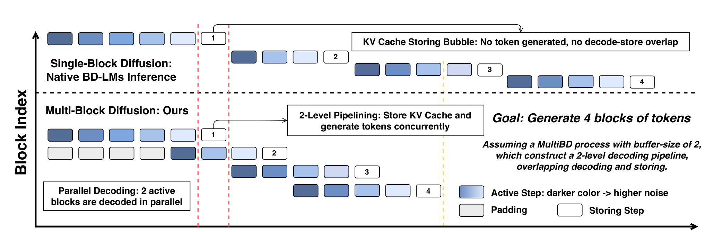
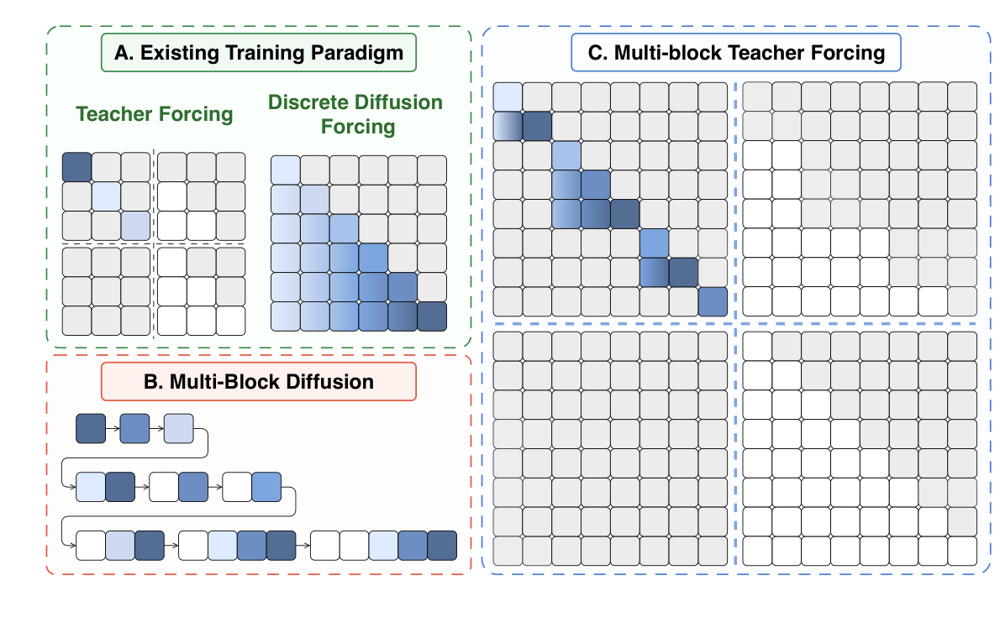
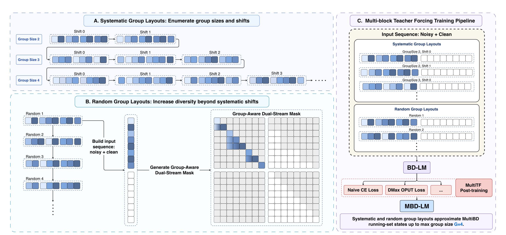
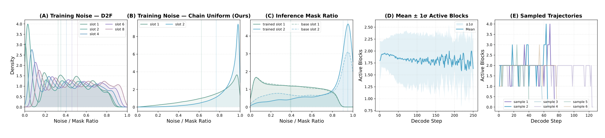
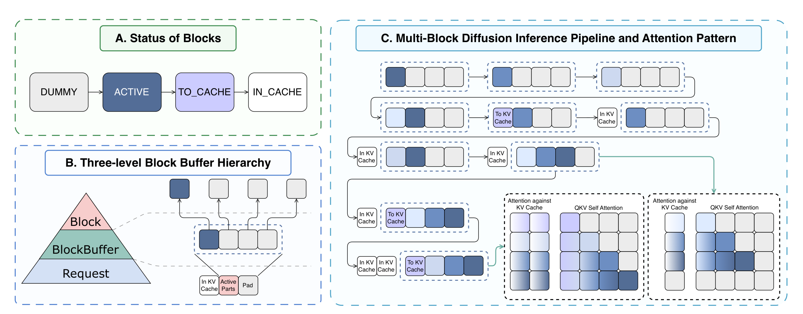
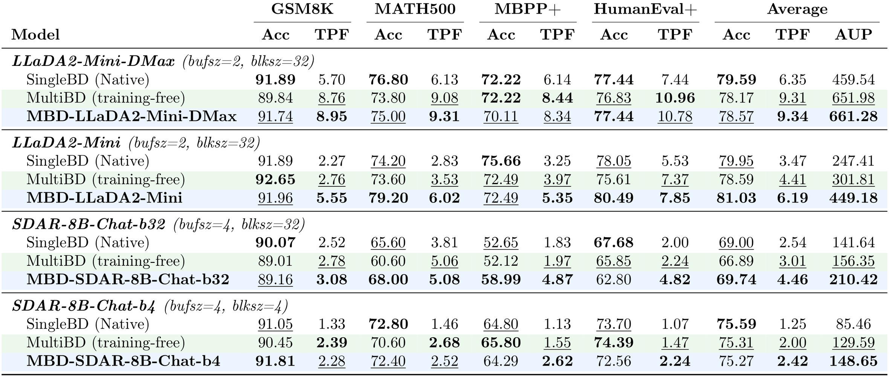
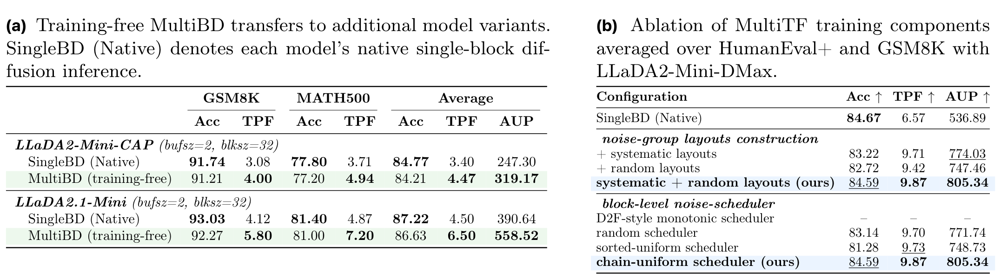
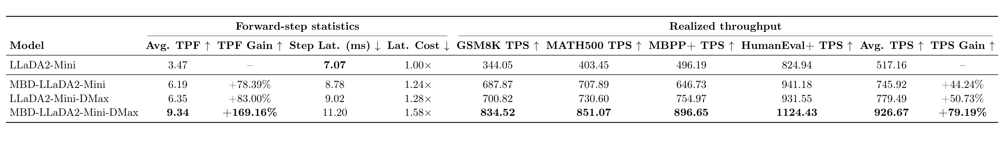

# Multi-Block Diffusion Language Models

<p align="center">
  <a href="https://sjtu-deng-lab.github.io/mbd-lms/"><b>Project Page</b></a> |
  <a href="https://github.com/SJTU-DENG-Lab/mbd-lms"><b>Code</b></a> |
  <b>Paper: TODO</b>
</p>
# Multi-Block Diffusion Language Models

<p align="center">
  
</p>

<p align="center">
  <a href="https://sjtu-deng-lab.github.io/mbd-lms/">
    
  </a>
  <a href="#">
    
  </a>
  <a href="#">
    
  </a>
  <a href="#license">
    
  </a>
</p>

This repository will host the official implementation of **Multi-Block Diffusion Language Models (MBD-LMs)**.

Block Diffusion Language Models (BD-LMs) improve diffusion-based text generation by enabling block-causal generation, KV caching, and flexible-length decoding. However, native BD-LMs typically perform **Single-Block Diffusion (SingleBD)**: each forward pass refines only one noisy block, while later blocks must wait until the current block is completed and committed to the KV cache. This leaves inter-block parallelism underused and introduces KV-cache storing bubbles.

MBD-LMs target **Multi-Block Diffusion (MultiBD)**, where a bounded running-set of consecutive blocks is refined concurrently. To make this practical, we introduce:

- **Multi-block Teacher Forcing (MultiTF)**, a post-training method that aligns BD-LMs with practical MultiBD inference states.
- **Block Buffer inference**, an optimized static-shape decoding mechanism that preserves prefix-cache reuse and enables CUDA Graph-friendly execution.
- A unified formulation that covers TF-trained BD-LMs, D2F-trained BD-LMs, and practical bounded MultiBD as different regimes.

> **Status:** Code, checkpoints, installation commands, and reproduction scripts will be added after release.

---

## Overview

SingleBD decodes blocks sequentially. Even though each block can use intra-block parallel denoising, blocks themselves are still processed one after another. In contrast, MultiBD decodes multiple active blocks in a bounded running-set and overlaps future-block refinement with KV-cache storing of completed blocks.

<p align="center">
  
</p>

**Figure 1.** SingleBD creates KV-cache storing bubbles because later blocks cannot be refined until earlier blocks are completed and cached. MultiBD overlaps decoding and storing by refining multiple consecutive blocks in parallel.

---

## Method

### Multi-Block Diffusion Language Models

At each decoding step, MultiBD maintains a running-set of consecutive blocks that have not yet been fully committed to the prefix KV cache. Blocks before the running-set form a clean cached prefix, while blocks inside the running-set may have different noise levels.

MBD-LMs define the model as recovering this running-set conditioned on the clean cached prefix and the current noisy states of the blocks inside the running-set. This formulation provides a unified view:

- **SingleBD** corresponds to the case where the running-set size is one.
- **D2F-style training** introduces visibility among multiple noisy blocks but does not directly match practical MultiBD inference.
- **Practical MultiBD** uses a bounded running-set, usually small, to balance inter-block parallelism and efficient execution.

<p align="center">
  
</p>

**Figure 2.** TF and D2F provide existing BD-LM training states, but neither directly matches practical MultiBD inference. MultiTF constructs bounded, inference-like noise-groups for post-training.

---

### Multi-block Teacher Forcing

MultiTF post-trains BD-LMs into MBD-LMs by constructing training states that resemble practical MultiBD inference. Instead of corrupting only one current block, MultiTF builds bounded groups of consecutive noisy blocks, called **noise-groups**.

MultiTF has three key components:

1. **Group-layout construction.**  
   Systematic layouts enumerate group sizes and shifts so that blocks appear at different group-relative positions. Random layouts add additional diversity beyond regular shifted layouts.

2. **Chain-uniform noise-scheduling.**  
   Within each noise-group, MultiTF samples monotonic but randomized block-level mask ratios. This creates heterogeneous slot-wise noise patterns that better match MultiBD inference.

3. **Group-Aware Dual-Stream Mask.**  
   Noisy blocks inside the same group can attend to preceding noisy blocks in the group, each noise-group can condition on clean prefix blocks, and clean tokens are prevented from attending to noisy tokens.

<p align="center">
  
</p>

**Figure 3.** MultiTF constructs systematic and random group-layouts, applies group-aware attention masks, and post-trains BD-LMs with masked CE or model-specific objectives such as DMax OPUT.

---

### Train-Inference Alignment

A central observation is that MultiBD inference does not simply expose the model to a long noisy suffix. In practice, it operates on a bounded active set, and adjacent active slots often have heterogeneous mask ratios. Therefore, reliable MultiBD requires training states that match both:

- the **bounded running-set size**, and
- the **slot-wise noise pattern** observed during inference.

<p align="center">
  
</p>

**Figure 4.** The chain-uniform scheduler creates more heterogeneous slot-wise noise distributions than D2F-style monotonic scheduling and better matches the mask-ratio patterns observed during MultiBD inference.

---

### Block Buffer Inference

A naive MultiBD implementation would dynamically grow and shrink the running-set, which changes input shapes across decoding steps. This is unfriendly to CUDA Graph capture and replay.

To address this, we introduce the **Block Buffer** mechanism. Each request maintains a fixed-size physical buffer containing several block slots. Real active blocks occupy part of the buffer, while unused slots are represented as dummy slots. Future blocks enter decoding by activating existing dummy slots rather than extending the input tensor.

Each slot follows the transition:

```text
dummy -> active -> to-cache -> in-cache
```

This design provides:

- **Inter-block parallelism:** multiple active blocks are refined jointly.
- **Decode-store overlap:** later blocks can be refined while earlier completed blocks are committed to KV cache.
- **Prefix-cache preservation:** committed blocks remain immutable cached prefix blocks.
- **Static-shape execution:** the physical input shape stays fixed for CUDA Graph replay.

<p align="center">
  
</p>

**Figure 5.** Block Buffer MultiBD separates cached prefix blocks from active buffer slots, enabling prefix KV reuse while refining multiple blocks in parallel.

---

## Main Results

We evaluate on math and code benchmarks:

- **GSM8K**
- **MATH500**
- **MBPP+**
- **HumanEval+**

We report:

- **Accuracy**, using exact match for math and pass@1 for code.
- **TPF**, Tokens Per Forward pass, measuring decoding parallelism.
- **AUP**, Accuracy Under Parallelism, summarizing the accuracy-parallelism trade-off.
- **TPS**, realized wall-clock throughput.

### Accuracy and Parallelism

<p align="center">
  
</p>

**Table 1.** MBD-LMs consistently improve TPF over native SingleBD. MultiTF usually recovers or improves quality compared with training-free MultiBD, leading to a better accuracy-parallelism trade-off.

Key results:

| Model | Configuration | Avg. Accuracy | Avg. TPF | Avg. AUP |
|---|---:|---:|---:|---:|
| LLaDA2-Mini | SingleBD | 79.95 | 3.47 | 247.41 |
| LLaDA2-Mini | MBD-LLaDA2-Mini | **81.03** | **6.19** | **449.18** |
| LLaDA2-Mini-DMax | SingleBD | 79.59 | 6.35 | 459.54 |
| LLaDA2-Mini-DMax | MBD-LLaDA2-Mini-DMax | 78.57 | **9.34** | **661.28** |
| SDAR-8B-Chat-b32 | SingleBD | 69.00 | 2.54 | 141.64 |
| SDAR-8B-Chat-b32 | MBD-SDAR-8B-Chat-b32 | **69.74** | **4.46** | **210.42** |
| SDAR-8B-Chat-b4 | SingleBD | **75.59** | 1.25 | 85.46 |
| SDAR-8B-Chat-b4 | MBD-SDAR-8B-Chat-b4 | 75.27 | **2.42** | **148.65** |

On LLaDA2-Mini, MBD-LLaDA2-Mini increases average TPF from **3.47** to **6.19** and improves average accuracy from **79.95%** to **81.03%**. When combined with DMax, MBD-LLaDA2-Mini-DMax reaches an average TPF of **9.34**, compared with **6.35** for LLaDA2-Mini-DMax under SingleBD.

---

### Transfer and Ablation

<p align="center">
  
</p>

**Table 2.** Training-free MultiBD transfers to additional model variants, while MultiTF component ablations show the importance of both group-layout construction and chain-uniform noise-scheduling.

Main observations:

- Training-free MultiBD can improve TPF on additional LLaDA2 variants without post-training.
- MultiTF is needed to recover or improve quality under practical MultiBD states.
- Systematic and random group-layouts are complementary.
- The chain-uniform scheduler gives the best accuracy-parallelism trade-off among tested schedulers.

---

### Realized Throughput

<p align="center">
  
</p>

**Table 3.** Throughput is measured for single-sample decoding on two H100 GPUs with tensor parallelism degree 2.

| Model | Avg. TPF | Step Latency | Avg. TPS | TPS Gain |
|---|---:|---:|---:|---:|
| LLaDA2-Mini | 3.47 | 7.07 ms | 517.16 | — |
| MBD-LLaDA2-Mini | **6.19** | 8.78 ms | **745.92** | **+44.24%** |
| LLaDA2-Mini-DMax | 6.35 | 9.02 ms | 779.49 | +50.73% |
| MBD-LLaDA2-Mini-DMax | **9.34** | 11.20 ms | **926.67** | **+79.19%** |

MBD increases the number of useful tokens committed per forward pass. Although the larger Block Buffer increases per-step latency, the TPF gain outweighs this cost, resulting in higher realized TPS.

---

## Installation

The implementation will be released in this repository.

```bash
git clone https://github.com/SJTU-DENG-Lab/mbd-lms.git
cd mbd-lms

# TODO: install dependencies after code release
# pip install -r requirements.txt
# pip install -e .
```

---

## Quick Start

The following commands are placeholders and will be updated after the code release.

### Inference

```bash
# TODO: add inference command
# python scripts/infer.py \
#   --model <checkpoint_path> \
#   --method multibd \
#   --buffer-size 2 \
#   --block-size 32 \
#   --prompt "..."
```

### Evaluation

```bash
# TODO: add evaluation command
# python scripts/evaluate.py \
#   --model <checkpoint_path> \
#   --benchmarks gsm8k math500 mbpp_plus humaneval_plus \
#   --method multibd
```

### MultiTF Post-training

```bash
# TODO: add MultiTF post-training command
# torchrun --nproc_per_node=<num_gpus> scripts/train_multitf.py \
#   --base-model <base_model_path> \
#   --max-group-size <Gmax> \
#   --block-size <block_size> \
#   --output-dir <output_dir>
```

---

## Checkpoints

Model checkpoints will be added after release.

| Model | Base Model | Status |
|---|---|---|
| MBD-LLaDA2-Mini | LLaDA2-Mini | TODO |
| MBD-LLaDA2-Mini-DMax | LLaDA2-Mini-DMax | TODO |
| MBD-SDAR-8B-Chat-b32 | SDAR-8B-Chat-b32 | TODO |
| MBD-SDAR-8B-Chat-b4 | SDAR-8B-Chat-b4 | TODO |

---

## Repository Structure

The final repository structure will be updated after code release. A tentative structure is:

```text
mbd-lms/
├── README.md
├── docs/
│   ├── index.html
│   ├── style.css
│   └── assets/
│       ├── cover.png
│       ├── fig1_singlebd_vs_multibd.png
│       ├── fig2_alignment_stats.png
│       ├── fig3_train_inference_paradigms.png
│       ├── fig4_multitf_overview.png
│       ├── fig5_block_buffer.png
│       ├── table1_main_results.png
│       ├── table2_transfer_ablation.png
│       └── table3_throughput.png
├── mbd_lms/
│   └── TODO: source code
├── scripts/
│   └── TODO: training, inference, and evaluation scripts
├── configs/
│   └── TODO: model and decoding configurations
└── requirements.txt
```

---

## Roadmap

- [ ] Release inference engine with Block Buffer MultiBD.
- [ ] Release MultiTF post-training code.
- [ ] Release evaluation scripts for math and code benchmarks.
- [ ] Release model checkpoints.
- [ ] Add official paper link.
- [ ] Add official BibTeX citation.
- [ ] Add license.

---

## Citation

Please cite our work if you find this repository useful.

```bibtex
TODO: Add official BibTeX after the paper is publicly released.
```

---

## Contact

For questions, please contact:

```text
Zhijie Deng: zhijied@sjtu.edu.cn
```

You may also open an issue in this repository after code release.

---

## License

TODO: Add license information.
<p align="center">
  <b>Yijie Jin, Jiajun Xu, Yuxuan Liu, Chenkai Xu, Yi Tu, Jiajun Li, Dandan Tu, Xiaohui Ye, Kai Yu, Pengfei Liu, Zhijie Deng</b>
</p>

<p align="center">
  Shanghai Jiao Tong University &nbsp; | &nbsp; Xi'an Jiao Tong University &nbsp; | &nbsp; Huawei
</p>

## Overview

This repository will host the official implementation of **Multi-Block Diffusion Language Models (MBD-LMs)**.

Block Diffusion Language Models (BD-LMs) support KV caching and flexible-length generation, but native BD-LMs usually perform **Single-Block Diffusion (SingleBD)**: each forward pass refines one noisy block conditioned on a clean cached prefix. This preserves the serving advantages of BD-LMs, but blocks are still processed sequentially.

MBD-LMs target reliable **Multi-Block Diffusion (MultiBD)**. The method decodes a bounded running-set of consecutive blocks concurrently, aligns training with this practical inference regime through **Multi-block Teacher Forcing (MultiTF)**, and serves the model with an optimized **Block Buffer** inference engine.

<p align="center">
  
</p>

## Highlights

- **Unified MBD-LM formulation.** MBD-LMs view BD-LM inference through a bounded running-set of consecutive blocks, covering SingleBD and practical MultiBD within a unified formulation.
- **MultiTF post-training.** Multi-block Teacher Forcing constructs inference-like bounded noise-groups with heterogeneous slot-wise noise patterns.
- **Optimized MultiBD inference.** The Block Buffer mechanism preserves prefix-cache reuse, keeps physical input shapes static, and enables decode-store overlap.
- **Improved accuracy-parallelism trade-off.** MBD-LLaDA2-Mini increases average TPF from 3.47 to 6.19 and improves average accuracy from 79.95% to 81.03% in the reported experiments. When combined with DMax, MBD-LLaDA2-Mini-DMax reaches an average TPF of 9.34 with only a 1.02 percentage-point average accuracy drop.

## News

- **2026-06:** Initial repository scaffold and project page.

## Project Page

The GitHub Pages project site is placed under [`docs/`](docs/). After enabling GitHub Pages from the `main` branch and `/docs` folder, the page will be available at:

```text
https://sjtu-deng-lab.github.io/mbd-lms/
```

## Installation

The code release is in preparation. Please replace this section with the final environment setup commands when the implementation is public.

```bash
git clone https://github.com/SJTU-DENG-Lab/mbd-lms.git
cd mbd-lms

# TODO: create environment
# conda create -n mbd-lms python=3.10
# conda activate mbd-lms

# TODO: install dependencies
# pip install -r requirements.txt
```

## Quick Start

Inference and evaluation commands will be added after the code release.

```bash
# TODO: download or specify model checkpoints

# TODO: run MultiBD inference
# python ...

# TODO: run benchmark evaluation
# bash ...
```

## Reproducing Experiments

The paper evaluates math reasoning and code generation on GSM8K, MATH500, MBPP+, and HumanEval+. The exact scripts, checkpoints, and configuration files should be added after release.

```bash
# TODO: add reproduction commands for GSM8K / MATH500
# TODO: add reproduction commands for MBPP+ / HumanEval+
# TODO: add throughput measurement commands
```

## Repository Structure

```text
mbd-lms/
├── README.md
├── docs/
│   ├── index.html
│   ├── style.css
│   ├── .nojekyll
│   └── assets/
│       ├── fig1_singlebd_vs_multibd.png
│       ├── fig2_alignment_stats.png
│       ├── fig3_train_inference_paradigms.png
│       ├── fig4_multitf_overview.png
│       ├── fig5_block_buffer.png
│       ├── table1_main_results.png
│       ├── table2_transfer_ablation.png
│       └── table3_throughput.png
└── .gitignore
```

Suggested code folders to add later:

```text
mbd_lms/              # source code
scripts/              # training, inference, evaluation scripts
configs/              # model and decoding configs
requirements.txt      # Python dependencies
tests/                # unit tests
```

## Results

| Model | Avg. Acc | Avg. TPF | Avg. TPS |
|---|---:|---:|---:|
| LLaDA2-Mini | 79.95 | 3.47 | 517.16 |
| MBD-LLaDA2-Mini | 81.03 | 6.19 | 745.92 |
| LLaDA2-Mini-DMax | 79.59 | 6.35 | 779.49 |
| MBD-LLaDA2-Mini-DMax | 78.57 | 9.34 | 926.67 |

The full benchmark tables are included in the project page under [`docs/index.html`](docs/index.html).

## Citation

The current draft does not include an official BibTeX entry. Please add the official citation after the paper is publicly released.

```bibtex
% TODO: add official BibTeX after release
```

## License

TODO: add license information before the public code release.

## Contact

For questions about the paper or repository, please contact:

```text
Zhijie Deng: zhijied@sjtu.edu.cn
```
